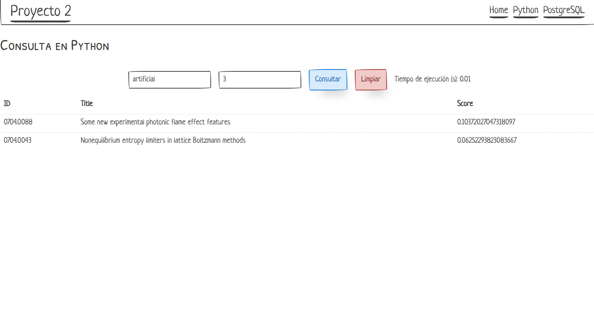

# Proyecto 02 - Base de datos 2

# Frontend

## Generalized Inverted Index (GIN)

El Generalized Inverted Index (GIN) es un tipo especial de índice diseñado para manejar búsquedas de texto. Aunque se puede usar con trigramas una implementación más optima resulta cuando se aplica sobre variables del tipo tsvector. Ya que cuando se crea un índice GIN en una columna de tipo tsvector, PostgreSQL genera un índice invertido que mapea cada palabra única en el tsvector a los documentos donde aparece. Esto permite una búsqueda eficiente de palabras clave y una clasificación de relevancia para la recuperación de documentos.

## Diseño del índice con PostgreSQL

### Creación de la base de datos

La estructura de nuestra tabla, la se cargó los datos de los json de **arXiv Dataset** es la siguiente:

```psql
CREATE TABLE IF NOT EXISTS articles_database(
  id_ TEXT,
  submitter TEXT,
  authors TEXT,
  title TEXT,
  comments_ TEXT,
  journal TEXT,
  doi TEXT,
  report_no TEXT,
  categories TEXT,
  license TEXT,
  abstract TEXT,
  versions TEXT,
  update_date TEXT,
  authors_parsed TEXT
);
```

Asimismo, creó el índice GIN en una nueva columna denominada **search_txt** que contiene los vectores caracteristicos del abstract del artículo. Aquí se muestra el código utilizado para su creación:

```psql
alter table articles_database add column search_txt tsvector;

update articles_database set search_txt = R.weight from (select id_, to_tsvector('english', abstract) as weight from articles_database) R where R.id_ = articles_database.id_;

create index json_idx_search on articles_database using GIN (search_txt);
```

Cabe resaltar que estas consultas query están implementadas en nuestro backend mediante las siguientes funciones hechas en python:

```py
def load_data_in_postgres(size) # Cargar data en Postgres
def get_news_query(self, query, top_k): # Realizar la consulta del top-k
```

### Conexión del Backend con la base de datos

La conexión con la base de datos se hace mediante el paquete **psycopg2**, es así que la query utilizada para realizar las búsquedas es la siguiente:

```py
""" SELECT id_, title, ts_rank_cd(search_txt, query) AS score
                        FROM articles_database, phraseto_tsquery('english','{query}') query
                        WHERE query @@ search_txt
                        ORDER BY score DESC
                        LIMIT {top_k};"""
```

Se puede observar que los parámetros que varían son {query} y {top_k} que básicamente son datos que se traerán del frontend. Asimismo, se debe recalcar que se utiliza la función **phraseto_tsquery** para convertir la query en su vector caracteristico y así obtener un mejor resultado en la búsqueda. Por otro lado, también se implementa la función **ts_rank_cd** para obtener el grado de similitud de las conultas y obtener las k más relevantes, las cuales son señaladas con el parámetro **top_k**.

## Screenshots de la GUI

### Ruta principal

En esta ruta principalmente tenemos la carga de los índices tanto para nuestro índice invertido en python como en PostgreSQL


### Consultas en Python



### Consultas en Postgres


# Análisis de datos
## Carga de datos

Se testeó la carga de datos/documentos para cantidades rangos distintos de datos:
- rango1: [5,000: 50,000] en intervalos de 5,000 
- rango2: [100,000: 500,000] en intervalos de 100,000. 

El rango de [5,000: 50,000] evidenciaría el crecimiento de la complejidad computacional en cantidades de datos pequeñas, mientras que el rango de [100,000: 500,000] evidenciaría el crecimiento de la complejidad computacional en cantidades de datos grandes.
El procedimiento de carga se datos se realizó tanto en Postgres como en el algoritmo creado en Python.

|  | Python | Postgres |
|-----------|-------|----------------|
| 500	|19,53 |1,977 |
|1.000|34,98 |4,601 |
|1.500|56,70 |5,100 |
|2.000|74,65 |6,446 |
|2.500|91,13 |8,080 |
|3.000|103,62|9,616 |
|3.500|129,69|11,163|
|4.000|139,73|13,358|
|4.500|172,66|15,051|
|5.000|175,58|17,241|


## Búsqueda

Las búsquedas se realizaron sobre las mismas cantidades de datos cargadas de modo que los intervalos [5,000: 50,000] y [100,000: 500,000] se mantienen.
El procedimiento de búsqueda se realizó tanto en Postgres como en el algoritmo creado en Python.

|  | Python | Postgres |
|-----------|-------|----------------|
| 500	|0,133|0,020	|
|1.000|0,420|0,012	|
|1.500|0,516|0,019	|
|2.000|0,643|0,022	|
|2.500|0,991|0,029	|
|3.000|1,120|0,031	|
|3.500|1,507|0,031	|
|4.000|1,547|0,036	|
|4.500|1,657|0,038  |
|5.000|1,671|0,051	|


